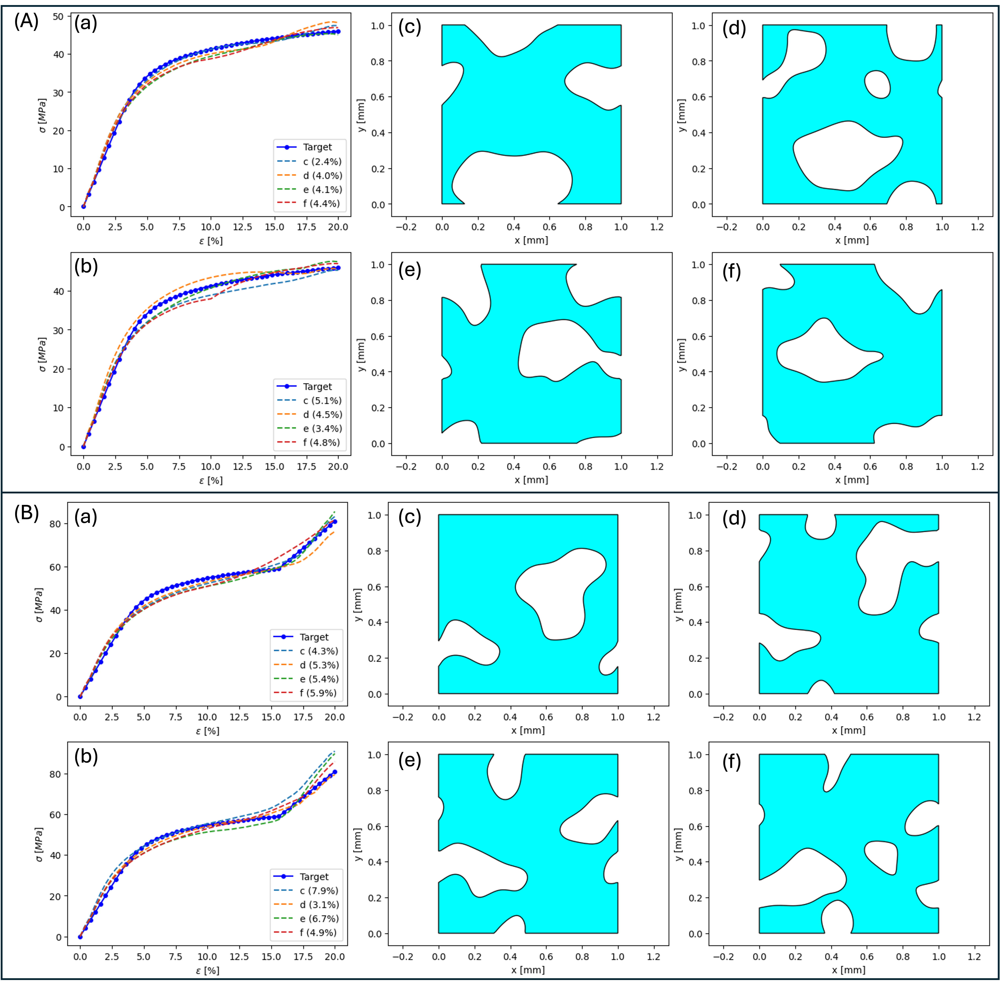

# Towards SDF-based Metamaterial Design: Neural Operator Transformer for Forward Prediction and Diffusion Models for Inverse Design

## Methodology

Figure 1: Overview of model architectures. The inverse denoising diffusion model (b) is used to design the micro-structure geometry represented by SDF, given the target stress-strain curve. The noise estimator is a residual U-Net architecture, and each residual block takes as input the image from the previous layer, the time step $t$, and the stress-strain curve. The iterative denoising process generates the SDF from pure Gaussian noise, from which the geometry is extracted using a marching algorithm. Two forward neural operator transformers (NOT) (a) are developed to predict the macroscopic stress-strain curve and local solution fields for arbitrary geometries. A residual U-net encodes the geometry represented by SDF to key (K) and value (V) for the attention mechanism. The query points, either the strain $\varepsilon$ or node coordinates $(x,y)$, are encoded using NeRF and an MLP as the Query (Q) for the attention mechanism, which fuses the geometry information and query points information. The output of a few attention blocks is decoded using an MLP to the solution fields on the query points.

## Inverse Design

Figure 2: On-demand one-to-many unit cell design. Two target stress-strain curves are generated using the Ramberg-Osgood equation. The top case has material properties of Young's modulus $E=800$ MPa and reference yield stress $\sigma_{0}=30$ MPa. The bottom case is obtained using $E=1000$ MPa and $\sigma_{0}=40$ MPa, but stress only follows the Ramberg-Osgood equation for $\varepsilon \leq 0.156$. For $\varepsilon \in [0.156,0.2]$, the stress increases linearly with Young's modulus of $500$ MPa. These two target curves are fed into the inverse diffusion model for 500 SDF solutions with guidance weight $w=1$, which are then fed into the forward models for prediction. We select 4 design results with the lowest $L_{2}$ relative error, shown in (c), (d), (e), and (f). (a) shows the comparison between the target and prediction of (c), (d), (e), and (f) using the forward model, with the $L_{2}$ relative error in the legend bracket. (b) shows the corresponding stress-strain curves obtained using Abaqus simulation.

## Forward prediction of designed periodic unit cell

Figure 3: Comparison of Mises stress and displacement between FEM ground truth and NOT prediction at different strain $\varepsilon$ steps for the designed structure in Figure 2(B)(e). The left panel shows the true Mises stress on the true deformed shape, the middle panel shows the predicted Mises stress on the predicted deformed shape, and the right panel shows the absolute error of the Mises stress on the true deformed shape.

## Dataset
The dataset used for training and evaluation is publicly available on [Zenodo](https://doi.org/10.5281/zenodo.15121966).
## Reference

 - Liu, Qibang, Seid Koric, Diab Abueidda, Hadi Meidani, and Philippe Geubelle. "Towards Sign Distance Function based Metamaterial Design: Neural Operator Transformer for Forward Prediction and Diffusion Models for Inverse Design." arXiv preprint arXiv:2504.01195 (2025).
 https://doi.org/10.48550/arXiv.2504.01195

